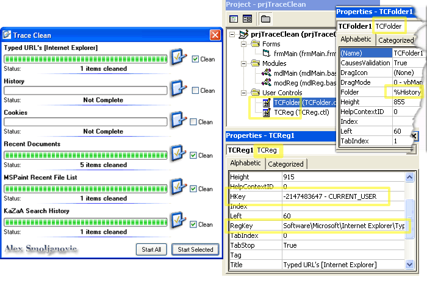

<div align="center">

## TraceClean


</div>

### Description

Trace Cleaner

Very simple yet scaleable "Trace Cleaner" application.

Uses two built in User Controls (Registry, and Special Shell Folder) handlers.

Cleans: IE Typed URLs, Recent Documents History, URL History IE, Kazaa Search Phrases, MSPaint Recent File List, Temp Internet

Files, History, Cookies. And any other Registry Key, or Special Shell Folder.

This was requested by someone in 2003, I rediscovered this project while organizing some of my older work and decided to post it on PSCode,

after a few minor modification to make it more readable scaleable.

Even though this VB Project should work as it is, please DON'T interpret this as a full

or Purpose Specific type application.

This project may also be useful to you if you are interested in the

following:

Windows Shell, Windows System Registry/Registry Key Enumeration, Re-Usable

Classes/User Controls

Yours sincerely,

Alex Smoljanovic [Salex] 2005.
 
### More Info
 


<span>             |<span>
---                |---
**Submitted On**   |2005-05-20 18:09:12
**By**             |[Alex Smoljanovic\(aLeX^rS\)](https://github.com/Planet-Source-Code/PSCIndex/blob/master/ByAuthor/alex-smoljanovic-alex-rs.md)
**Level**          |Beginner
**User Rating**    |5.0 (10 globes from 2 users)
**Compatibility**  |VB 6\.0
**Category**       |[Complete Applications](https://github.com/Planet-Source-Code/PSCIndex/blob/master/ByCategory/complete-applications__1-27.md)
**World**          |[Visual Basic](https://github.com/Planet-Source-Code/PSCIndex/blob/master/ByWorld/visual-basic.md)
**Archive File**   |[TraceClean1890165202005\.zip](https://github.com/Planet-Source-Code/alex-smoljanovic-alex-rs-traceclean__1-60607/archive/master.zip)

### API Declarations

```
Declare Function RegCloseKey Lib "advapi32.dll" (ByVal HKey As Long) As Long
Declare Function RegCreateKey Lib "advapi32.dll" Alias "RegCreateKeyA" (ByVal HKey As Long, ByVal lpSubKey As String, phkResult As Long) As Long
Declare Function RegDeleteValue Lib "advapi32.dll" Alias "RegDeleteValueA" (ByVal HKey As Long, ByVal lpValueName As String) As Long
Declare Function RegOpenKey Lib "advapi32.dll" Alias "RegOpenKeyA" (ByVal HKey As Long, ByVal lpSubKey As String, phkResult As Long) As Long
Declare Function RegQueryValueEx Lib "advapi32.dll" Alias "RegQueryValueExA" (ByVal HKey As Long, ByVal lpValueName As String, ByVal lpReserved As Long, lpType As Long, lpData As Any, lpcbData As Long) As Long
Declare Function RegSetValueEx Lib "advapi32.dll" Alias "RegSetValueExA" (ByVal HKey As Long, ByVal lpValueName As String, ByVal Reserved As Long, ByVal dwType As Long, lpData As Any, ByVal cbData As Long) As Long
Declare Function RegEnumValue Lib "advapi32.dll" Alias "RegEnumValueA" (ByVal HKey As Long, ByVal dwIndex As Long, ByVal lpValueName As String, lpcbValueName As Long, ByVal lpReserved As Long, lpType As Long, lpData As Any, lpcbData As Long) As Long
```


